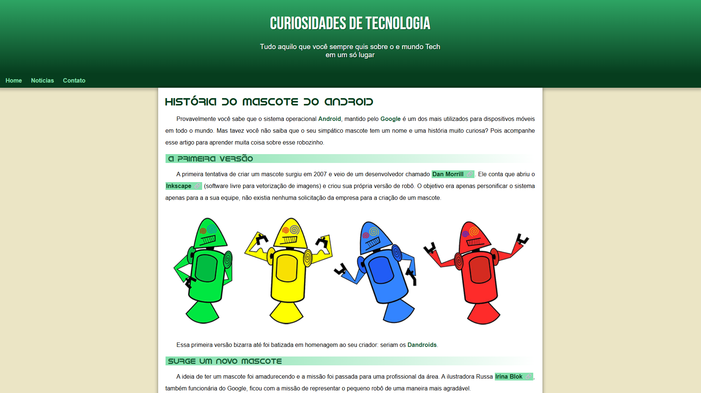
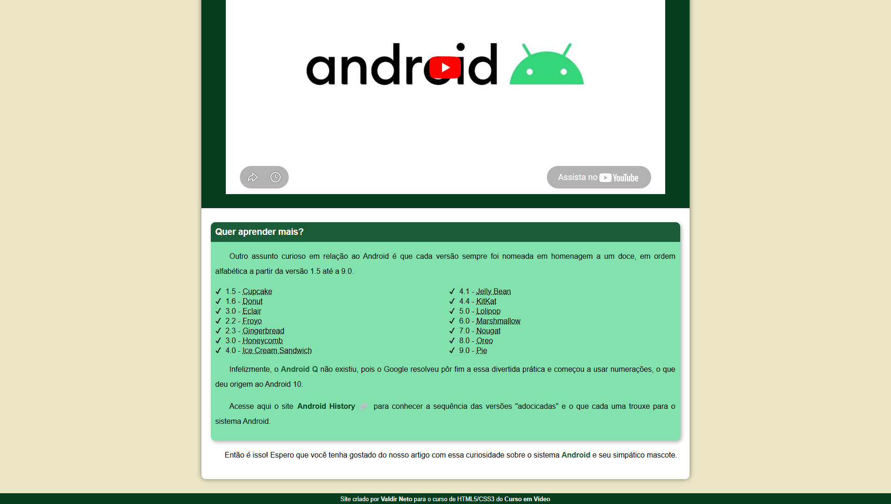

# 🤖 Curiosidades de Tecnologia: O Mascote do Android

Este é um site responsivo desenvolvido para contar a história e as curiosidades por trás do simpático mascote do sistema operacional Android, o Bugdroid. 

Este projeto foi construído como parte da conclusão do **Módulo 2 do curso de HTML5 e CSS3 do Curso em Vídeo**, servindo como uma excelente prática para consolidar conceitos de estruturação semântica e estilização avançada.

---

## 🚀 Tecnologias e Conceitos Aplicados

O desenvolvimento focou em aplicar boas práticas modernas de Front-end, sem a utilização de frameworks, escrevendo o código do zero. Os principais conceitos abordados foram:

* **HTML5 Semântico:** Uso apropriado de tags como `<header>`, `<nav>`, `<main>`, `<article>`, `<aside>` e `<footer>` para melhorar a acessibilidade e o SEO.
* **Variáveis CSS (Custom Properties):** Implementação de um esquema de cores centralizado no `:root` (`--cor0` a `--cor5`), facilitando a manutenção e consistência visual do tema do Android.
* **Tipografia Customizada:** Utilização da regra `@font-face` para importar a fonte original do Android (`idroid.otf`), além da integração com o Google Fonts.
* **Responsividade com `<picture>`:** Uso do elemento `<picture>` em conjunto com `<source>` para carregar imagens otimizadas dependendo do tamanho da tela (`max-width: 670px`), economizando banda em dispositivos móveis.
* **Vídeos Responsivos:** Aplicação de técnica com `position: absolute` e `padding-bottom` em um container para garantir que o `iframe` do YouTube se adapte perfeitamente a qualquer resolução.
* **Pseudo-elementos:** Uso de `::after` para inserir automaticamente o ícone de link (🔗) em todos os links externos da página.

---

## 📚 O que eu aprendi

Durante a execução deste projeto acompanhando as aulas, pude aprofundar meu entendimento sobre:
1. **Organização de CSS:** Como o uso de variáveis deixa o código muito mais limpo e profissional.
2. **Design Responsivo:** A importância de planejar o layout para se adaptar a diferentes telas, utilizando `max-width`, `margin: auto` e técnicas de redimensionamento de mídia.
3. **Efeitos Visuais:** Criação de profundidade e destaque utilizando `box-shadow`, `text-shadow` e `linear-gradient`.

---

## 📖 Como visualizar o projeto?

[👉 Clique aqui para acessar o site Curiosidades do Android](https://valdirneto34.github.io/Projeto-Android/)

---

## 🛠️ Como rodar localmente?

1. Clone este repositório em sua máquina:
   ```bash
   git clone https://valdirneto34.github.io/Projeto-Android/
   ```

---

## 📖 Screenshots do Projeto
   <p align="center">
        
    </p>
   <p align="center">
        
    </p>